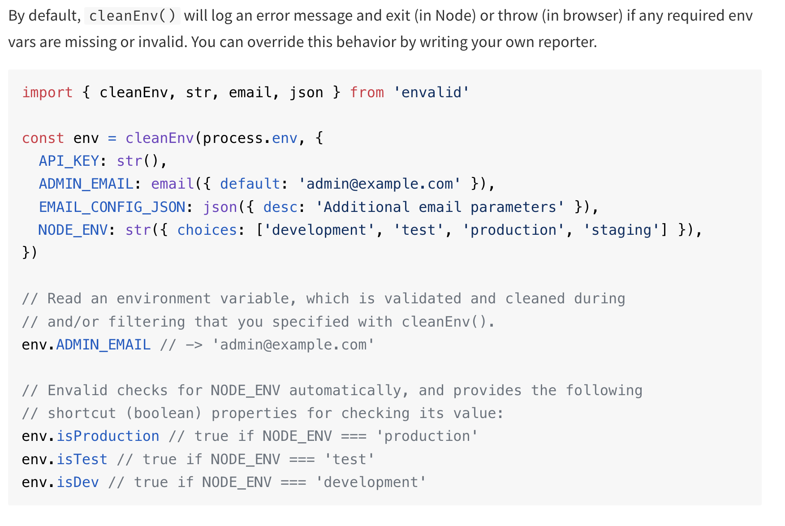

# mern-with-typescript-practice
A responsive MERN stack note taking app with cookie sessions instead of JWT auth built with TS.

# initialization
## setting up packages with TS in mind
- mkdir backend frontend
- cd backend; npm init -y
- npm i --save-dev typescript;
- npx tsc --init        // for generating the tsconfig.json
- For TS projects we also need to install a package that contains the type related to a package so that our code works properly and TS knows what types the different functions and variables have, so:
- npm i express
- npm i --save-dev @types/express

## naming conventions and folder structure
- keep all the source code in `src`, everything outside it is for configuration


## package.json and scripts:
- required for some web hostings: "main": "dist/server.js",
- `"dev": "npx tsc; node --env-file .env --watch --trace-warnings dist/server.js"`
or install nodemon and ts-node then do:
- `"dev":"npx nodemon src/server.ts"`
- npm i -D eslint


## `envalid` package - a small library for validating and accessing environment variables in Node.js programs
- it enforces a schema on the env variables
- Type-safe: written completely in TypeScript, with great support for inference

- npm i envalid
- `envalid.cleanEnv(environment, validators, options)`
    - `environment` - An object containing your env vars (eg. process.env)
    - `validators` - An object that specifies the format of required vars.

### The following validation functions are available:

- `str()` - Passes string values through, will ensure a value is present unless a default value is given. Note that an empty string is considered a valid value - if this is undesirable you can easily create your own validator (see below)
- `bool()` - Parses env var strings "1", "0", "true", "false", "t", "f" into booleans
- `num()` - Parses an env var (eg. "42", "0.23", "1e5") into a Number
email() - Ensures an env var is an email address
host() - Ensures an env var is either a domain name or an ip address (v4 or v6)
port() - Ensures an env var is a TCP port (1-65535)
url() - Ensures an env var is a URL with a protocol and hostname
json() - Parses an env var with JSON.parse
Each validation function accepts an (optional) object with the following attributes:

`choices` - An Array that lists the admissible parsed values for the env var.
`default` - A fallback value, which will be present in the output if the env var wasn't specified. Providing a default effectively makes the env var optional. Note that default values are not passed through validation logic, they are default output values.
`devDefault` - A fallback value to use only when NODE_ENV is explicitly set and not 'production'. This is handy for env vars that are required for production environments, but optional for development and testing.
`desc` - A string that describes the env var.
`example` - An example value for the env var.
`docs` - A URL that leads to more detailed documentation about the env var.

# A crucial error debugging point in TS:
- there could be a type mismatch due to a version differnece between, npm i @types/express and npm i express, both commands install the latest versions which could be problematic, for example:
 ```sh
 npm list express @types/express                   ─╯

backend@1.0.0 /Users/yashmeena/Desktop/stuff/git repos/mern-with-typescript-practice/backend
├── @types/express@5.0.0
└── express@4.21.1
```